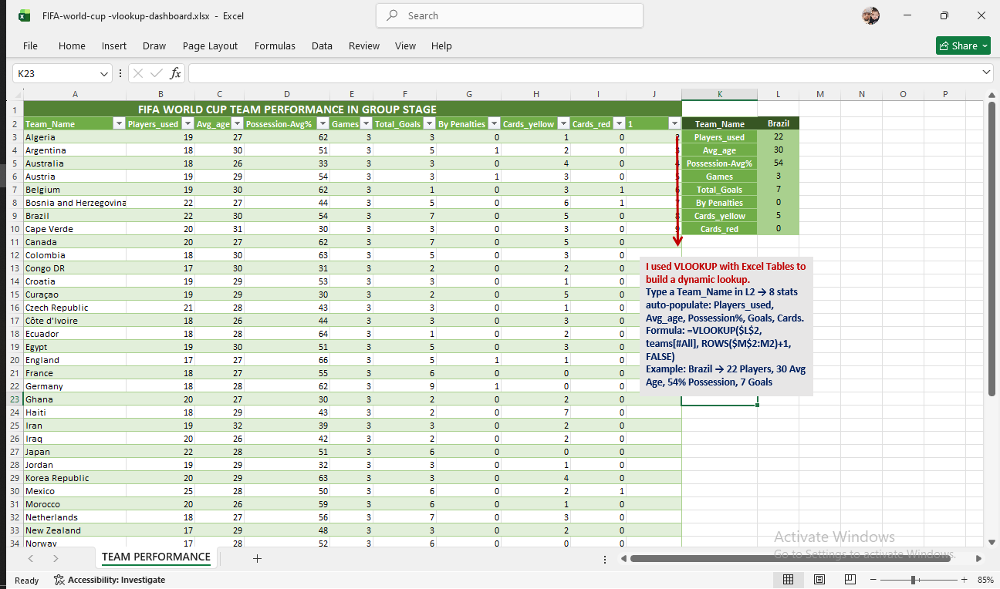

# FIFA World Cup Group Stage Analysis

Excel VLOOKUP dashboard. Type a team name to pull 8 stats from FIFA World Cup group stage data.

### How it works
Type any `Team_Name` in cell `L2` → 8 stats auto-populate in `M2:M9`.

# Key Formula
***excel
=VLOOKUP($L$2, teams[#All], ROWS($M$2:M2)+1, FALSE)
### Example
`Brazil` → 22 Players, 30 Avg Age, 54% Possession, 7 Goals, 0 Red Cards

### Skills Used
Excel Tables, VLOOKUP, Data Validation, Dashboard Design

